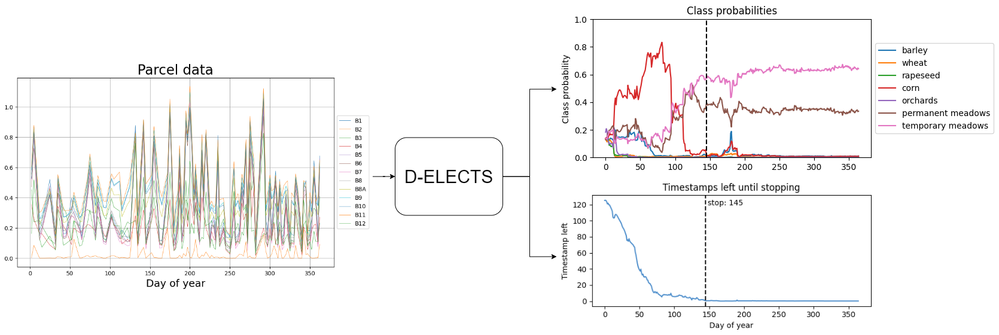
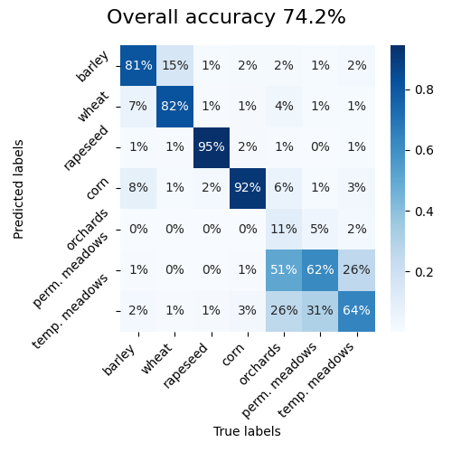
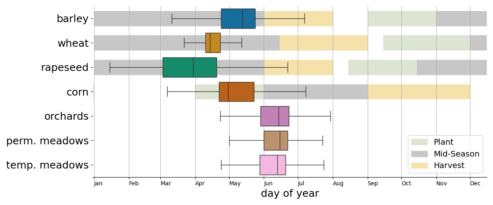

# D-ELECTS - In Season Crop Classification using Satellite Imagery
This repository contains the source code of my master thesis project at ETH. We proposed an innovative early crop classification model named D-ELECTS, which is based on the ELECTS model.

*Figure 1. Diagram of the D-ELECTS model workflow. The input is the average Sentinel-2 reflectance aggregated by parcel, with 13 spectral bands. The model processes incrementally the multivariate time series. It outputs the probability distribution across the crop types (displayed in the top right) and the time period until the model stops predicting (shown at the bottom right). The model continues to intake more data points as long as the time until final prediction is above zero. In this specific example, the D-ELECTS model predicts the class temporary meadows at a stopping time of 145, indicated as a vertical black line*



**Table of Contents**
- [D-ELECTS - In Season Crop Classification using Satellite Imagery](#d-elects---in-season-crop-classification-using-satellite-imagery)
  - [1. Abstract](#1-abstract)
  - [2. Dependencies](#2-dependencies)
  - [3. Train the Model](#3-train-the-model)
    - [3.1 Monitor training](#31-monitor-training)
    - [3.2 Start training loop](#32-start-training-loop)
    - [3.3 Other training variants (optional)](#33-other-training-variants-optional)
      - [3.3.1 Sweep Train](#331-sweep-train)
      - [3.3.2 Final Train](#332-final-train)
  - [4. Test the Model](#4-test-the-model)
  - [5. Notebooks](#5-notebooks)
  - [6. References](#6-references)

## 1. Abstract
Crop classification is a crucial task that can be hugely simplified by remote sensing data, as it is the gateway
technology for a more effective and sustainable supervision of arable land. For most applications, such as
fertilization and water consumption, crop type classification need to be given in real-time, as early as possible
during the growing season. Rußwurm et al. proposed End-to-end Learned Early Classification of Time
Series (ELECTS) as an early crop classification model. Based on their work, our study aims to trade between
accuracy and earliness. Using their model as benchmark, our goal is to reach even earlier predictions, as well
as to align the variability of our model’s predictions with the variability expected from phenology.
To do so, we develop the Daily ELECTS (D-ELECTS) model, which estimates a classification score and
a time period until final prediction. Our model mainly relies on the structure of satellite time series data; each
timestamp of the time series correspond to one day. The D-ELECTS cost function optimizes the classification
accuracy, the prediction earliness and the time period until final prediction.
Our experiments show that D-ELECTS results in earlier predictions than ELECTS, while maintaining
a reasonable accuracy for most practical purposes. Our work suggests the great potential of earlier and
more concentrated predictions, aligned with phenological variability. Additionally, it offers a countdown
before final classification, which is useful for practical applications. 


## 2. Dependencies 

```bash
python -m venv venv
source venv/bin/activate
pip install -r requirements.txt
```


## 3. Train the Model

### 3.1 Monitor training 
Create an account on [wandb](https://wandb.ai) and login to your account in the terminal
```bash
wandb login
```
Create a project on wandb. 

Then, fill the [`personal_config.yaml`](config/personal_config.yaml) file with your wandb data 

```yaml 
entity: <username>
project: <projectname>
```	

### 3.2 Start training loop
To start training loops on the train set, run
```bash 
python train.py --configpath <configpath>
```
where `<configpath>` is the path to the model configuration file, in json format. An example is given in [`config/best_model_config.json`](config/best_model_config.json).
The BreizhCrops dataset is automatically downloaded. 

Medias will be shown in the wandb dashboard, as the distributions of the predictions stopping times, the class probabilities with respect to time, and the time until final prediction. Examples of their evolutions throughout the epochs are available below.

*Video 1. Distributions of the predictions stopping times*

https://github.com/user-attachments/assets/c5474bed-3f3c-4829-85be-cb2ae25b0e75

*Video 2. Class probabilities with respect to time*

https://github.com/user-attachments/assets/f281ae29-c754-4b24-a6bf-b038c949dca6

*Video 3. Time until final prediction*

https://github.com/user-attachments/assets/e843d8fa-13d6-4356-9123-1b9f74d8aa91


### 3.3 Other training variants (optional)
Two training variants are available in the [`training_variants`](training_variants) folder. They aim to optimize the hyperparameters of the model and to train the model on the training and validation sets.

#### 3.3.1. Sweep Train
For hyperparameter optimization, you can use the [`train_sweep.py`](training_variants/train_sweep.py) script. To do so, first initialize a sweep with
```bash
wandb sweep --project <projectname> <configpath>
```
where `<configpath>` is the path to the sweep configuration file. An example of sweep configuration file is given in [`config/sweep_config.yaml`](config/sweep_config.yaml).
Make sure to change `dataroot` and `snapshot` values to the correct paths. This command will return a `<sweep_id>`.

Then, launch wandb agent with 
```bash
wandb agent <username>/<projectname>/<sweep_id>
```
where `<sweep_id>` is the id of the sweep you initialized. You can follow the training process on the wandb dashboard.

You can find the best model via the wandb dashboard, and download the configuration file from there. You can also find the best model by downloading the results locally and selecting the model according to your preferences. See the beginning of the notebook [`prediction_one_parcel.ipynb`](notebooks/prediction_one_parcel.ipynb)  for an example on how to load the results of a sweep. 

Save the configuration file of the selected model in json format.

#### 3.3.2. Final Train
Once the best configuration of hyperparameters is found, you can train the model on both the training and the validation sets with the [`final_train.py`](training_variants/final_train.py) script. To do so, run
```bash 
python training_variants/final_train.py --configpath <configpath>
```
where `<configpath>` is the path to the selected model configuration file. An example is given in [`config/best_model_config.json`](config/best_model_config.json).

## 4. Test the Model
To test the model on the test set, run
```bash
python test.py --run-name <run-name>
```
where `<run-name>` is the name of the wandb run you want to test. The test set is automatically downloaded.
Several options are available with `python test.py --help`.

The results of the test are locally saved in the `artifacts/<run_id>` folder. Several plots will be created, such as the normalized confusion matrix and the boxplots of the predictions stopping times. Moreover, the videos of training predictions will be saved in the `media` folder. 

*Figure 2. Confusion Matrix*



*Figure 3. Boxplots of the predictions stopping times*




## 5. Notebooks
In the `notebooks` folder, you can find several notebooks to reproduce the results of the paper.
1. [`dataset_plot.ipynb`](notebooks/dataset_plot.ipynb) - explore the BreizhCrops and the Reduced BreizhCrops datasets;
2. [`plot_maps.ipynb`](notebooks/plot_maps.ipynb) - load a wandb run and plot the classification maps;
3. [`prediction_one_parcel.ipynb`](notebooks/prediction_one_parcel.ipynb) - view the runs of the wandb project, select one run, and predict the crop type of a single parcel. Make sure to add the sweep name in the [`personal_config.yaml`](config/personal_config.yaml) file under the `sweep` key.
4. [`results_table.ipynb`](notebooks/results_table.ipynb) - load the results of the wandb project and create a table with the results of some selected runs.


## 6. References
> Marc Rußwurm, Nicolas Courty, Remi Emonet, Sebastien Lefévre, Devis Tuia, and Romain Tavenard (2023). End-to-End Learned Early Classification of Time Series for In-Season Crop Type Mapping. ISPRS Journal of Photogrammetry and Remote Sensing. 196. 445-456. https://doi.org/10.1016/j.isprsjprs.2022.12.016

> Marc Rußwurm, Charlotte Pelletier, Maximilian Zollner, Sebastien Lefèvre, and Marco Körner. 
Breizhcrops: A time series dataset for crop type mapping. International Archives of the Photogrammetry, Remote Sensing and Spatial Information Sciences ISPRS (2020), 2020
